Overview
========

This walkthrough configures an ASP.NET MVC .NET Core Web App using Amazon
Cognito

Topics Covered
--------------

In this walk-through, you’ll build the following – An Amazon Cognito User Pool
to authenticate, store and manage users and configure a ASP.NET Web App that can
be hosted in AWS as well as how to do role based authentication
in Amazon Cognito using Cognito Groups

Pre-requisites
--------------

-   An AWS account with Administrative rights

-   Select the us-east-1 (N.Virginia) Region

-   Visual Studio 2019 Community Edition or better with the AWS toolkit
    installed

-   .NET Core 3.1 runtime

Task 1. Create Amazon Cognito User Pool
---------------------------------------

In this task, you’ll create and configure User Pool from AWS Management Console


----------------------------------------------------------

Follow the steps one by one in this section, to automate the Cognito Configuration

```

#### Step 1: Open the AWS Console, navigate to the Cognito UI and click Manage User Pools

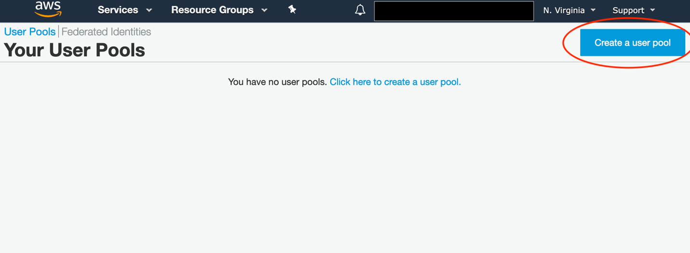

#### Step 2: Next click Create User Pool

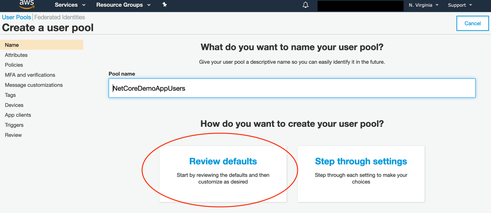

#### Step 3: Enter “NetCoreDemoAppUsers” for the Pool Name and click Review Defaults

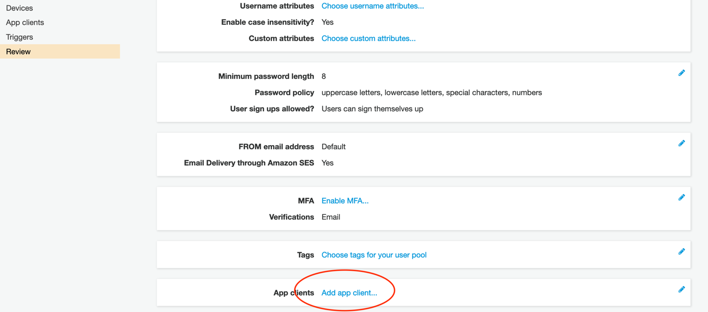

#### Step 4: Click on Add app client

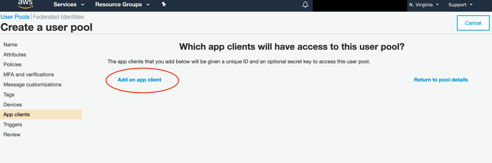

#### Step 5: Click on Add app client

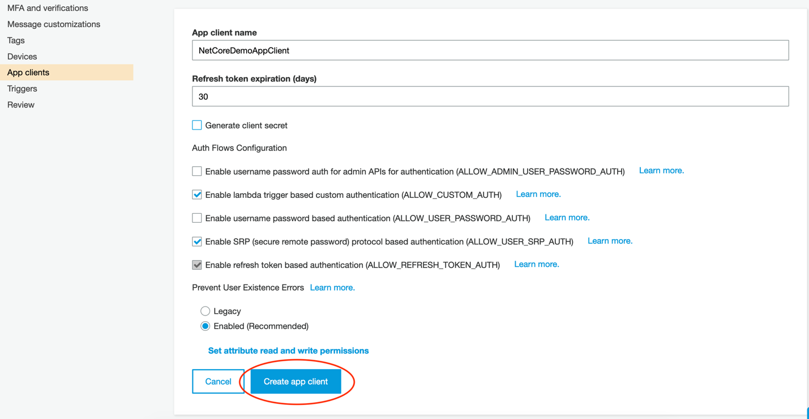

*Step 6: Enter the following and click Create app client* – App Client Name:
NetCoreAppClient and Uncheck the Generate client secret checkbox

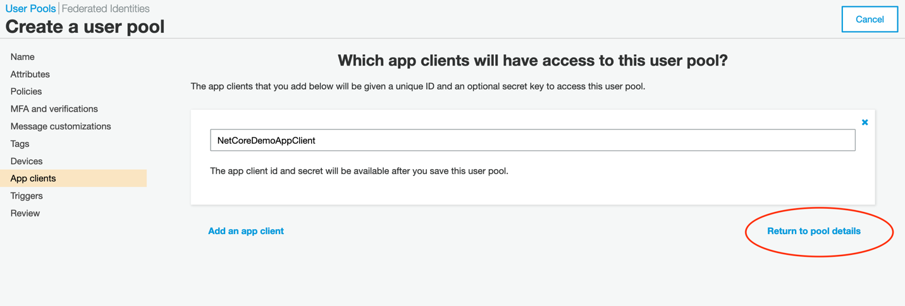

#### Step 7: Click Return to pool details

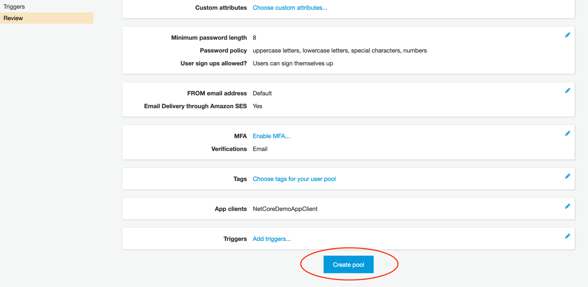

#### Step 8: Click Create Pool

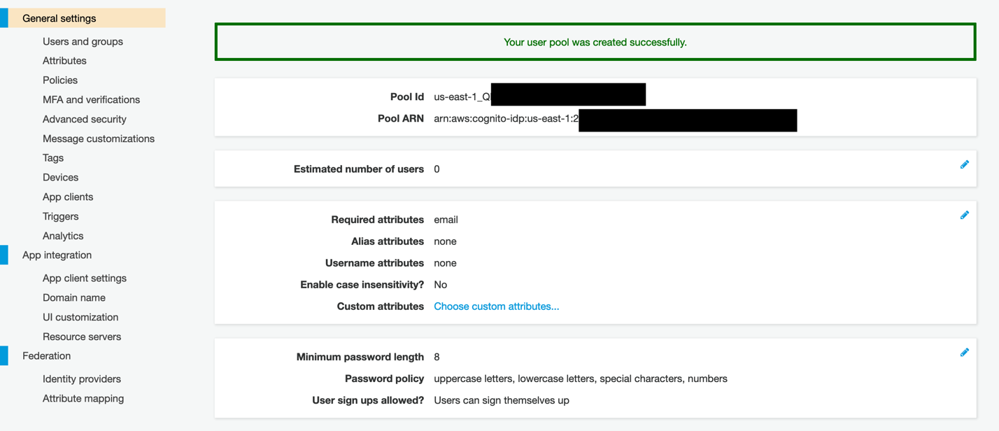

#### Step 9: Review the pool settings and copy the Pool id into the text editor and you will need this to configure your .NET App

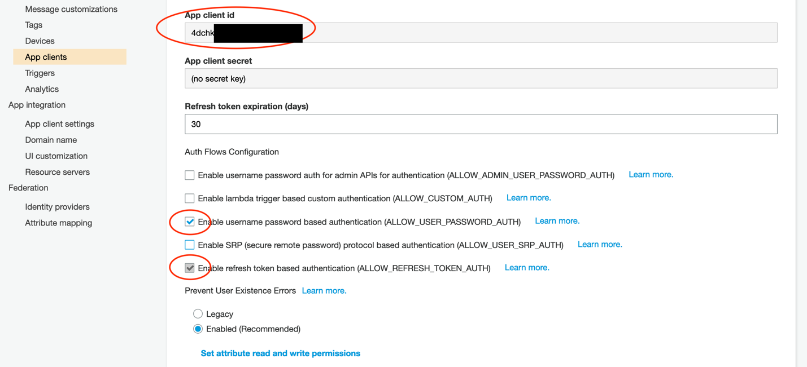


#### Step 10:Next, select the User Pool, that you've created from the previous step and under General Settings --> Users and Groups, create a group called "Admin" as shown in the screenshot below


Task 2: Setup App Client
------------------------

#### Step 10: Go to App Client Settings, check the options highlighted and copy the ClientID and paste it in the text editor, we’ll use it when we configure the .NET App

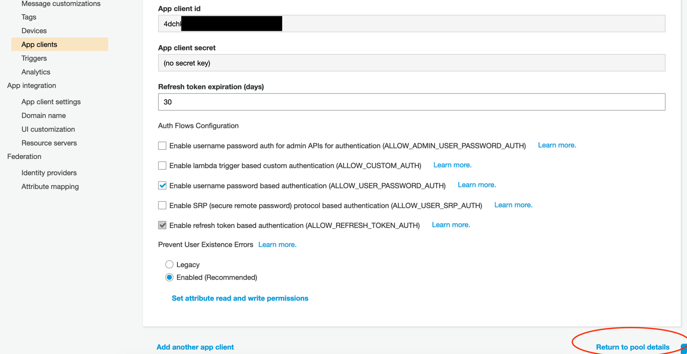

#### Step 11: When finished with the above step, click return to pool details

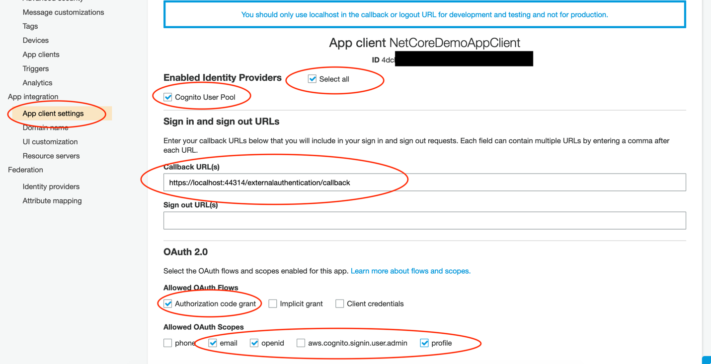

Task 3: Setup App Integration
-----------------------------

#### Step 12: Go to App client settings under App Integration, and check the following

-   Check the box – Select all, Cognito User Pool

-   Enter the callback url from your .NET App ex:
    <https://localhost:44314/externalauthentication/callback>

-   Under OAuth 2.0, check the following options

    -   Check the box – Authorization code grant

-   Under Allowed OAuth Scopes, check the following options

    -   email, openid, profile

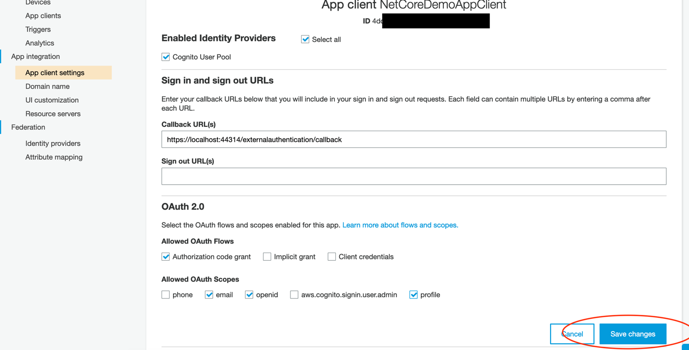

#### Step 13: Review the above steps and click save changes to apply the settings


Task 4: Setup Amazon Cognito Domain
-----------------------------------

We will use this interface provided by Cognito to sign up and log in users. If
you plan to build your own UI, this is possible, and this step can be skipped
but this is outside the scope of this exercise

#### Step 14: Go to Domain name under App Integration, and enter the domain prefix and click to save changes

Note: For the purpose of this lab, we are using the US-EAST-1 (N.Virginia)
region, please make a note of which region you are working in we creating Url’s
and configuring applications.

Make a note of the following Or you can save it on the Database for futher uses:

-   App Client ID

-   Pool Id

-   Callback Url

-   Sign Out Url

-   Cognito Domain (fully qualified cognito domain url)

Task 5: Create .NET Core ASP.NET MVC Web Application
----------------------------------------------------

In this task you’ll be creating a .NET Core ASP.NET Web Application. This is
a sample project which will demonstrate the seamless integration of Amazon
Cognito

Pre-requisites:

-   Visual Studio 2019 Community Edition or higher

-   .NET Core 3.1

-   AWS Toolkit for Visual Studio

-   <https://aws.amazon.com/visualstudio/>

-   C\# Coding Skills


#### Step 15: Start the project where you want to implement this service.

#### Step 16: AWS Cognito Authentication details are save in Database , there is another way to save this details via appsetting.json file .
      /// Fetch the following details from the Database 
      1.Role Name
      2.AppClientID
      3.AWSAcessKeyID
      4.AWSApiversion
      5.AWSRegion
      6.AwsSecretAccessKey
      7.AwsSecretAccessKey

Task 6: Review .NET Core Web Application and Configuration
----------------------------------------------------------

The sample application shows how to use the OpenID Connect ASP.NET Core
middleware to sign-in users using Amazon Cognito User Pool. The middleware is
initialized in the Startup.cs file by passing the Client Id and the Cognito
Metadata Url which is configured with the Pool Id from the above. The middleware
takes care of downloading the Cognito metadata, and processing the OpenID
requests and responses for sign up and sign in. You can trigger the middleware
to send an OpenID Connect Sign-in request by decorating the class or an action
method with the [Authorize] attribute.

Refer to the configuration details below.

#### Step 17: OpenID Connect Configuration in Startup.cs 
```
        // This method gets called by the runtime. Use this method to add services to the container.
        public void ConfigureServices(IServiceCollection services)
        {
             services.AddTransient<IAccountService, AccountService>();
        }
      // This is Service Class from where we get the Credentails like clientID and verify that the user is already exist in 
          the pool aur not 
         public class CognitoService : BaseService, ICognitoService
     {

       protected IAccountService _accountService;
        private readonly UserManager<ApplicationUser> _userManager;
        private readonly IWebHostEnvironment _environment;
        private static string screenNameHeader;
        private static string accessControlExposeHeaders;
        private static string contentDisposition;

        public AccountController(IWebHostEnvironment environment,
           IIdentityService identityService,
           UserManager<ApplicationUser> userManager, 
           IThrowService throwService,
           IAccountService accountService,
           IConfiguration configuration, 
           ILogger<AccountController> logger) :
           base(identityService, throwService, environment)
        {
            _accountService = accountService;
            _userManager = userManager;
            _environment = environment;
            this._logger = logger;
            screenNameHeader = configuration.GetSection("Custom_Request_Headers:screen_name").Value;
            accessControlExposeHeaders = configuration.GetSection("Custom_Request_Headers:access_control_expose_headers").Value;
            contentDisposition = configuration.GetSection("Custom_Request_Headers:content_disposition").Value;
        }
        
     }
```
#### Step 18: Authentication Middleware Configuration

```

        // This method gets called by the runtime. Use this method to configure the HTTP request pipeline.
       public void Configure(IApplicationBuilder app, IWebHostEnvironment env,ILog logger)
        {
            if (env.IsDevelopment())
            {
                app.UseDeveloperExceptionPage();
            }

            app.UseCors(builder => builder.AllowAnyOrigin().AllowAnyHeader().AllowAnyMethod());
            var forwardingOptions = new ForwardedHeadersOptions()
            { ForwardedHeaders = ForwardedHeaders.XForwardedFor | ForwardedHeaders.XForwardedProto | ForwardedHeaders.All };

            app.UseForwardedHeaders(forwardingOptions);
            app.Use(async (context, next) =>
            {
                context.Response.Headers.Add("Content-Type", "application/json");
                context.Features.Get<IHttpMaxRequestBodySizeFeature>().MaxRequestBodySize = 4294967295;
                await next();
            });
            app.UseDefaultFiles();
            app.UseStaticFiles();
            app.ConfigureExceptionHandler(logger);
            app.UseRouting();
            app.UseAuthentication();
            app.UseAuthorization();
            #region Culprit
            app.UseMiddleware<TokenProviderMiddleware>(Options.Create(TokenProviderOptions));
            // dbinitializer.Init();
            #endregion
            app.UseGlobalExceptionMiddleware();
            app.UseDefaultFiles();
            app.UseStaticFiles();
            //app.UseMvc();
            app.UseOptions();
            app.UseSwagger();
            app.UseSwaggerUI(c =>
            {
                c.SwaggerEndpoint("/swagger/v1/swagger.json", "Pulse API");
            });

            app.UseEndpoints(endpoints =>
            {
                endpoints.MapDefaultControllerRoute();
            });
        }
        ```
Task 7: Test the application
-------------------------------------------------
Now we are trying to sign in the application using the credentials {Username & Password}
After enter a username then it will verified by aws cognito as same process run for password verification.

.png)

-------------------------------------------------------------------------------------------------
This Method provide the authication details and check the credentails that are filled by the user are correct or not.This method will take the credentails like username and password by this method it send a request to AWS cognito to verify that the user is already exist in the Pool or not .

```
    public async Task<Tuple<int, string, string>> VerifyUserOnAWSAsync(string userName, string userIpAddress, string browserName)
        {
            int statusCode = 0;
            string error = string.Empty;
            string cognitoUserName = string.Empty;
            var trackLogin = new TrackLogin();
            SendErrorToText("Start objCognitoUser" + System.DateTime.Now);
            var objCognitoUser = await _newUserManagerRepository.GetCognitoUserAsync(userName: userName);
            SendErrorToText("End objCognitoUser" + System.DateTime.Now);
            if (objCognitoUser != null && objCognitoUser.Any())
            {
                if (!objCognitoUser.FirstOrDefault().IsInActive)
                {
                    cognitoUserName = objCognitoUser.FirstOrDefault().UserName;
                    SendErrorToText("Start objAWS" + System.DateTime.Now);
                    var objAWS = await _newAccountRepository.GetAWSCredtionals(ApplicationUser.AdminRoleName.ToString());
                    SendErrorToText("End objAWS" + System.DateTime.Now);
                    if (objAWS != null)
                    {
                        try
                        {
                            AmazonCognitoIdentityProviderClient provider = new AmazonCognitoIdentityProviderClient(objAWS.AwsAccessKeyId, objAWS.AwsSecretAccessKey, Region);
                            AdminGetUserRequest adminUpdateUserAttributesRequest = new AdminGetUserRequest();
                            adminUpdateUserAttributesRequest.Username = cognitoUserName;
                            adminUpdateUserAttributesRequest.UserPoolId = objAWS.AwsUserPoolId;

                            SendErrorToText("Start response" + System.DateTime.Now);
                            var response = await provider.AdminGetUserAsync(adminUpdateUserAttributesRequest);
                            SendErrorToText("End response" + System.DateTime.Now);
                            if (response != null && !string.IsNullOrEmpty(response.Username) && response.UserStatus.Value != "UNCONFIRMED"
                                && response.UserAttributes.FirstOrDefault(x => x.Name == "email_verified").Value == "true")
                            {
                                if (response.UserStatus.Value != "RESET_REQUIRED")
                                {
                                    statusCode = Convert.ToInt32(HttpStatusCode.OK);
                                }
                                else
                                {
                                    statusCode = Convert.ToInt32(HttpStatusCode.ResetContent);
                                }
                            }
                            else
                            {
                                string name = string.Empty;
                                SendErrorToText("Start user" + System.DateTime.Now);
                                var user = await _userManager.FindByNameAsync(userName);
                                SendErrorToText("End user" + System.DateTime.Now);
                                SendErrorToText("Start role" + System.DateTime.Now);
                                var role = await _userManager.GetRolesAsync(user);
                                SendErrorToText("End role" + System.DateTime.Now);
                                var userRole = role.FirstOrDefault();
                                if (userRole.ToLower() != "superadmin")
                                {
                                    SendErrorToText("Start portfolioId" + System.DateTime.Now);
                                    var portfolioId = await GetPortfolioIdByRoleAndIdAsync(userRole, user.Id);
                                    SendErrorToText("End portfolioId" + System.DateTime.Now);
                                    SendErrorToText("Start userDetail" + System.DateTime.Now);
                                    var userDetail = await _newAccountRepository.GetUsersByIdAsync(Guid.Parse(portfolioId), user.Id);
                                    SendErrorToText("End userDetail" + System.DateTime.Now);
                                    if (userRole.ToLower() == ApplicationUser.ParticipantRoleName.ToLower() && userDetail.Participant != null)
                                    {
                                        name = userDetail.Participant.FirstName + " " + userDetail.Participant.LastName;
                                        userRole = "Employee";
                                    }
                                    else if ((userRole.ToLower() == ApplicationUser.EmployerRoleName.ToLower() || userRole.ToLower() == ApplicationUser.ClientContactRoleName.ToLower()) && userDetail.Employer != null)
                                    // userRole.ToLower() == ApplicationUser.IncentiCareReadOnlyRoleName.ToLower())

                                    {
                                        userRole = userRole.ToLower() == ApplicationUser.EmployerRoleName.ToLower() ? "Client" : (userRole.ToLower() == ApplicationUser.ClientContactRoleName.ToLower() ? "Client Contact" : "Incenticare Read Only");
                                        name = userDetail.Employer.ClientName;
                                    }
                                    //else if ((userRole.ToLower() == ApplicationUser.SpouseRoleName.ToLower()|| userRole.ToLower() == ApplicationUser.DependentRoleName.ToLower()) && userDetail.Dependent != null)
                                    //{
                                    //    name = userDetail.Dependent.FirstName + " " + userDetail.Dependent.LastName;
                                    //}
                                    else if (userRole.ToLower() == ApplicationUser.ClientManagerRoleName.ToLower() && userDetail.ClientManager != null)
                                    {
                                        name = userDetail.ClientManager.FirstName + " " + userDetail.ClientManager.LastName;
                                        userRole = "Client Manager";
                                    }
                                    else if (userRole.ToLower() == ApplicationUser.AdminRoleName.ToLower() && userDetail.Admin != null)
                                    {
                                        name = userDetail.Admin.FirstName + " " + userDetail.Admin.LastName;
                                    }
                                }
                                error = name + "~" + userRole;
                                statusCode = Convert.ToInt32(HttpStatusCode.Created);
                            }
                        }
                        catch (Exception ex)
                        {
                            var userExistInPulse = await ValidateUserInPulseAsync(userName);
                            if (userExistInPulse)
                            {
                                statusCode = Convert.ToInt32(HttpStatusCode.Continue);
                            }
                            else
                            {
                                statusCode = Convert.ToInt32(HttpStatusCode.NotFound);
                                error = CommonErrorMessages.UserNameIncorrect;
                                trackLogin.UserName = userName;
                                trackLogin.LoginIPAddress = userIpAddress;
                                trackLogin.Browser = browserName;
                                trackLogin.FailureReason = error;
                                await SaveTrackLoginDetail(trackLogin);
                            }
                        }
                    }
                }
                else
                {
                    SendErrorToText("Start userExistInPulse" + System.DateTime.Now);
                    var userExistInPulse = await ValidateUserInPulseAsync(userName);
                    SendErrorToText("End userExistInPulse" + System.DateTime.Now);
                    if (userExistInPulse)
                    {
                        statusCode = Convert.ToInt32(HttpStatusCode.Continue);
                    }
                    else
                    {
                        SendErrorToText("Start SaveTrackLoginDetail" + System.DateTime.Now);
                        statusCode = Convert.ToInt32(HttpStatusCode.NotFound);
                        error = CommonErrorMessages.UserNameIncorrect;
                        trackLogin.UserName = userName;
                        trackLogin.LoginIPAddress = userIpAddress;
                        trackLogin.Browser = browserName;
                        trackLogin.FailureReason = error;
                        await SaveTrackLoginDetail(trackLogin);
                        SendErrorToText("End SaveTrackLoginDetail" + System.DateTime.Now);
                    }
                }
            }
            else
            {
                SendErrorToText("Start userExistInPulse" + System.DateTime.Now);
                var userExistInPulse = await ValidateUserInPulseAsync(userName);
                SendErrorToText("End userExistInPulse" + System.DateTime.Now);
                if (userExistInPulse)
                {
                    statusCode = Convert.ToInt32(HttpStatusCode.Continue);
                }
                else
                {
                    SendErrorToText("Start userExistInPulse SaveTrackLoginDetail" + System.DateTime.Now);
                    statusCode = Convert.ToInt32(HttpStatusCode.NotFound);
                    error = CommonErrorMessages.UserNameIncorrect;
                    trackLogin.UserName = userName;
                    trackLogin.LoginIPAddress = userIpAddress;
                    trackLogin.Browser = browserName;
                    trackLogin.FailureReason = error;
                    await SaveTrackLoginDetail(trackLogin);
                    SendErrorToText("End userExistInPulse SaveTrackLoginDetail" + System.DateTime.Now);
                }
            }

            return Tuple.Create(statusCode, error, cognitoUserName);
        }
        ```
-----------------------------------------------------------------------------------------------------------------------------------
By this method,When user entered the credentials and Press the submit button and API get response on the basis of the resposne from the API it verify every single Time from the AWS cognito that the user entered the correct credentials or not .
```
 verifyCognitoUser() {
        this.loading = true;
        this.errors = [];
        this._loginService.varifyUserOnAWSAsync(this.form.get('username').value.trim()).subscribe(
            response => {
                this.loading = false;
                if (response.item1 == 100 || response.item1 == 200) {
                    this.isVerfy = true;
                    localStorage.setItem('CognitoAppUser', response.item3);
                    this.isPulseUser = response.item1 == 100;
                    localStorage.setItem('CognitoAppUser', response.item3);
                }
                else if (response.item1 == 201) {
                    localStorage.setItem('CurrentUser', this.form.get('username').value.trim());
                    localStorage.setItem('CurrentRole', response.item2.split('~')[1]);
                    localStorage.setItem('CurrentUserName', response.item2.split('~')[0]);
                    localStorage.setItem('CognitoAppUser', response.item3);
                    this._router.navigate(['/resend/verification/link']);
                }
                else if (response.item1 == 205) {
                    localStorage.setItem('CognitoUserName', this.form.get('username').value.trim());
                    localStorage.setItem('CognitoAppUser', response.item3);
                    this._router.navigate(['/auth/send-verification-code']);
                    return false;
                }
                else {
                    this.errors = [];
                    this.errors.push({
                        'errorMessage': response.item2
                    });
                }
            }, error => {
                this.loading = false;
                this.errors = [];
                this.errors.push({
                    'errorMessage': CommonMessages.unknownErrorMessage
                });
            });
    }
```
---------------------------------------------------------------------------------------
And you can view and manage all the users from the aws console
.png)


